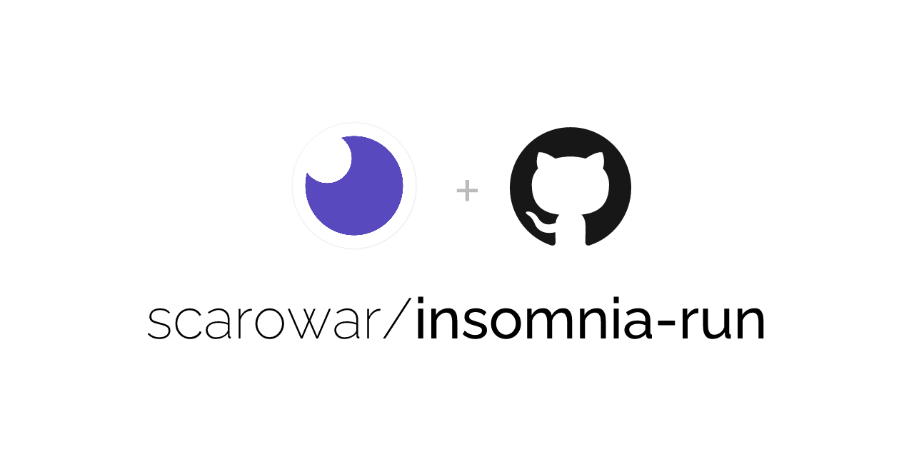

<picture>
  <source media="(prefers-color-scheme: dark)" srcset="docs/assets/images/cover-dark.png">
  <source media="(prefers-color-scheme: light)" srcset="docs/assets/images/cover-light.png">
  
</picture>

<p align="center">
  <a href="https://github.com/scarowar/insomnia-run/actions/workflows/ci.yml"></a>
  <a href="https://github.com/scarowar/insomnia-run/actions/workflows/codeql.yml"></a>
  <a href="https://github.com/scarowar/insomnia-run/blob/main/LICENSE"></a>
  <!-- ALL-CONTRIBUTORS-BADGE:START - Do not remove or modify this section -->
  <a href="#contributors-"></a>
  <!-- ALL-CONTRIBUTORS-BADGE:END -->
</p>

<p align="center">
  <a href="https://scarowar.github.io/insomnia-run/">Documentation</a> •
  <a href="https://scarowar.github.io/insomnia-run/getting-started/">Getting Started</a> •
  <a href="https://scarowar.github.io/insomnia-run/examples/">Examples</a>
</p>

---

A GitHub Action that runs your Insomnia collections and test suites in CI/CD pipelines with automatic PR comment reporting.

## Features

- **GitHub Actions Native**: Drop-in action with simple YAML configuration
- **Automatic PR Comments**: Post test results directly to pull requests
- **Markdown Reports**: Clean, readable output for workflow summaries
- **Flexible Exit Codes**: Control workflow failure behavior
- **Environment Support**: Target different Insomnia environments per run
- **Secure Secrets**: Pass credentials safely via GitHub Secrets

## Quick Start

```yaml
- uses: scarowar/insomnia-run@v0.1.0
  with:
    command: collection
    working-directory: .insomnia
```

## Inputs

| Input | Required | Default | Description |
|-------|----------|---------|-------------|
| `command` | Yes | | `collection` or `test` |
| `working-directory` | Yes | | Path to `.insomnia` or export file |
| `identifier` | No | | Collection/test suite name or ID |
| `environment` | No | | Insomnia environment to use |
| `pr-comment` | No | `true` | Post results as PR comment |
| `fail-on-error` | No | `true` | Fail workflow on test failures |

[View all inputs](https://scarowar.github.io/insomnia-run/reference/inputs/)

## Outputs

| Output | Description |
|--------|-------------|
| `markdown` | Generated test report in Markdown format |
| `exit-code` | `0` for pass, `1` for fail |

## Documentation

| Guide | Description |
|-------|-------------|
| [Getting Started](https://scarowar.github.io/insomnia-run/getting-started/) | First run in 5 minutes |
| [Collections](https://scarowar.github.io/insomnia-run/guides/collections/) | Run API collections |
| [Test Suites](https://scarowar.github.io/insomnia-run/guides/test-suites/) | Run unit tests |
| [Secrets](https://scarowar.github.io/insomnia-run/guides/secrets/) | Handle credentials |
| [Examples](https://scarowar.github.io/insomnia-run/examples/) | Workflow snippets |
| [Troubleshooting](https://scarowar.github.io/insomnia-run/troubleshooting/) | Common issues |

## License

This project is licensed under the MIT License. See the [LICENSE](LICENSE) file for details.

## Contributors ✨

Thanks goes to these wonderful people ([emoji key](https://allcontributors.org/docs/en/emoji-key)):

<!-- ALL-CONTRIBUTORS-LIST:START - Do not remove or modify this section -->
<!-- prettier-ignore-start -->
<!-- markdownlint-disable -->
<table>
  <tbody>
    <tr>
      <td align="center" valign="top" width="14.28%"><a href="https://github.com/sagar-shaw-bits"><br /><sub><b>Sagar Shaw BITS</b></sub></a><br /><a href="https://github.com/scarowar/insomnia-run/commits?author=sagar-shaw-bits" title="Code">💻</a></td>
      <td align="center" valign="top" width="14.28%"><a href="https://github.com/cnaples79"><br /><sub><b>Chase Naples</b></sub></a><br /><a href="https://github.com/scarowar/insomnia-run/commits?author=cnaples79" title="Code">💻</a></td>
    </tr>
  </tbody>
</table>

<!-- markdownlint-restore -->
<!-- prettier-ignore-end -->

<!-- ALL-CONTRIBUTORS-LIST:END -->

This project follows the [all-contributors](https://github.com/all-contributors/all-contributors) specification. Contributions of any kind welcome!
