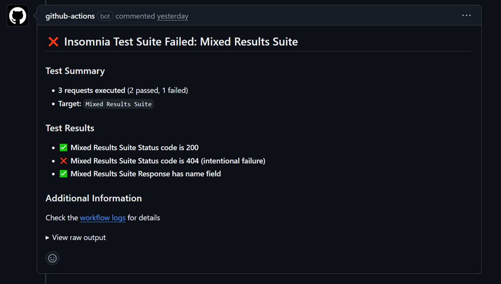

# Insomnia Run


Run Insomnia collections and test suites in GitHub Actions with PR comment reporting.

## Usage

```yaml
- uses: scarowar/insomnia-run@v0.1.0
  with:
    command: collection
    working-directory: .insomnia
```

## Features

| Feature | Description |
|---------|-------------|
| **Collections** | Run API request collections |
| **Test Suites** | Execute JavaScript unit tests |
| **PR Comments** | Auto-post results to pull requests |
| **JSON Output** | Machine-readable reports for automation |
| **Secrets** | Secure credential passthrough |
| **Multi-Environment** | Target dev, staging, production |
| **Configurable Timeouts** | Handle slow APIs and large collections |

## PR Comment Examples

=== "Passing Tests"

    

=== "Failing Tests"

    

## Inputs

| Input | Required | Description |
|-------|----------|-------------|
| `command` | Yes | `collection` or `test` |
| `working-directory` | Yes | Path to `.insomnia` or export file |
| `identifier` | No | Collection or test suite name |
| `environment` | No | Insomnia environment to use |
| `output-format` | No | Use `json` for machine-readable output |

[View all inputs →](reference/inputs.md)

## Outputs

| Output | Description |
|--------|-------------|
| `markdown` | Generated test report |
| `json-output` | JSON report (when `output-format: json`) |
| `exit-code` | `0` = pass, `1` = fail |

## Documentation

| Page | Description |
|------|-------------|
| [Getting Started](getting-started/index.md) | First run in 5 minutes |
| [Collections](guides/collections.md) | Run API collections |
| [Test Suites](guides/test-suites.md) | Run unit tests |
| [Secrets](guides/secrets.md) | Handle credentials |
| [Reference](reference/inputs.md) | All inputs & outputs |
| [Examples](examples/index.md) | Workflow snippets |
| [Troubleshooting](troubleshooting.md) | Common issues |
