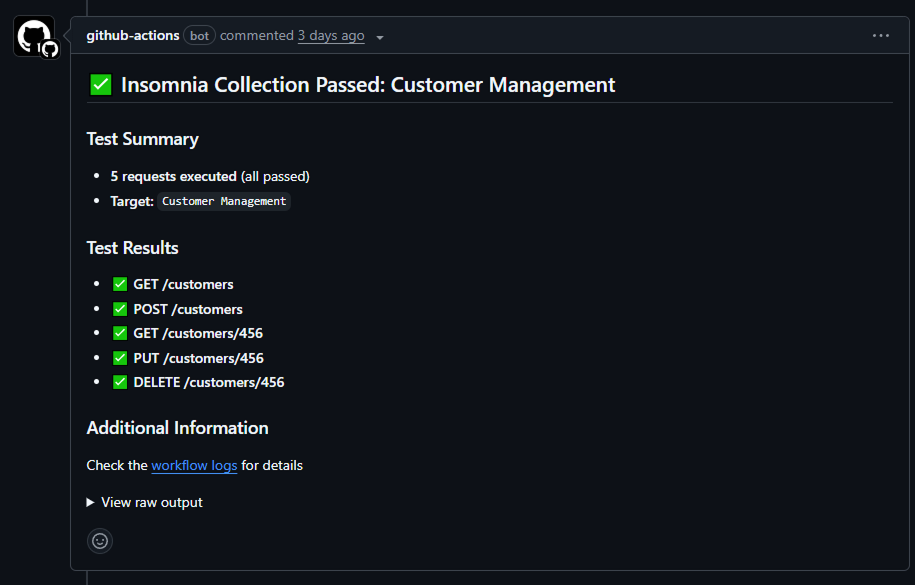
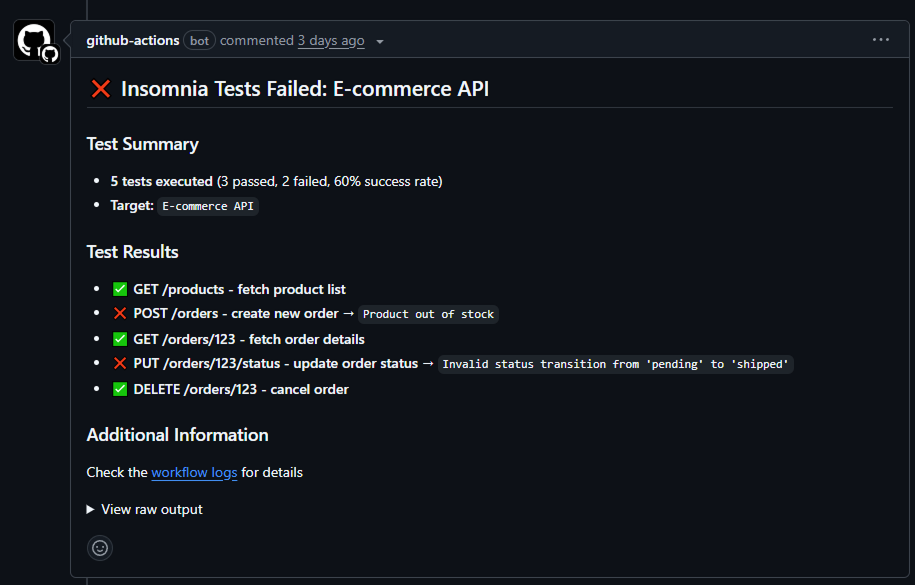

# Insomnia Run


[](https://github.com/scarowar/insomnia-run/blob/main/LICENSE)
[](https://sonarcloud.io/summary/new_code?id=scarowar_insomnia-run)
[](https://github.com/scarowar/insomnia-run/actions/workflows/codeql.yml)
[](https://github.com/scarowar/insomnia-run/security/dependabot)
[](https://results.pre-commit.ci/latest/github/scarowar/insomnia-run/main)

## Overview

Insomnia Run automates [Insomnia](https://insomnia.rest/) API testing in GitHub Actions workflows, delivering instant feedback through PR comments and comprehensive test reporting.

## Key Features

- **Automated API testing**: Execute Insomnia test suites and collections in CI/CD pipelines
- **PR-driven feedback**: Post detailed test results as pull request comments
- **Environment targeting**: Run tests against different environments with variable injection
- **Secure integration**: Native GitHub Actions secrets support

## Workflow Example

See how Insomnia Run provides instant API test feedback in your pull requests:

=== "1. Successful collection run"
	
    /// caption
	All API requests pass, showing green status with detailed test results posted to the PR.
    ///

=== "2. Failed test run"
	
    /// caption
	Test failures are clearly highlighted with error details for quick debugging.
    ///

## Quick Start

```yaml linenums="1" title=".github/workflows/api-tests.yml"
name: API Tests

on:
  pull_request:
  push:
    branches: [main]

permissions:
  contents: read
  pull-requests: write

jobs:
  test:
    runs-on: ubuntu-latest
    steps:
      - uses: actions/checkout@v4
      - uses: scarowar/insomnia-run@v0.1.0
        with:
          command: "test"
          identifier: "My Test Suite"
          github-token: ${{ secrets.GITHUB_TOKEN }}
```

!!! tip "Version Pinning Options"
    For maximum security, pin to a specific commit SHA. Find commit SHAs at our [releases page](https://github.com/scarowar/insomnia-run/releases).

## Need Help?

- **Questions?** Start a [discussion](https://github.com/scarowar/insomnia-run/discussions)
- **Found a bug?** Open an [issue](https://github.com/scarowar/insomnia-run/issues)
- **Security concern?** See our [security policy](https://github.com/scarowar/insomnia-run/blob/main/SECURITY.md)

## Contributing

We'd love your help making Insomnia Run even better! Check out our [contributing guide](https://github.com/scarowar/insomnia-run/blob/main/CONTRIBUTING.md) to get started.

## License

MIT License - see [LICENSE](https://github.com/scarowar/insomnia-run/blob/main/LICENSE) for details.

---

Made with :heart:{ .heart } in Mysuru, India
